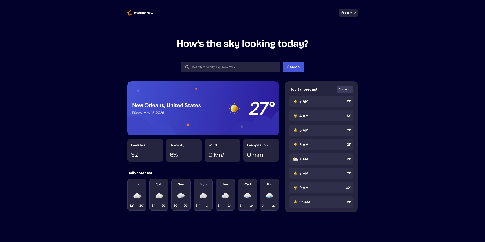

# Frontend Mentor - Weather app solution

This is a solution to the [Weather app challenge on Frontend Mentor](https://www.frontendmentor.io/challenges/weather-app-K1FhddVm49). Frontend Mentor challenges help you improve your coding skills by building realistic projects.

## Table of contents

- [Overview](#overview)
  - [The challenge](#the-challenge)
  - [Screenshot](#screenshot)
  - [Links](#links)
- [My process](#my-process)
  - [Built with](#built-with)
  - [Continued development](#continued-development)
  - [AI Collaboration](#ai-collaboration)
- [Author](#author)

## Overview

### The challenge

Users should be able to:

- Search for weather information by entering a location in the search bar
- View current weather conditions including temperature, weather icon, and location details
- See additional weather metrics like "feels like" temperature, humidity percentage, wind speed, and precipitation amounts
- Browse a 7-day weather forecast with daily high/low temperatures and weather icons
- View an hourly forecast showing temperature changes throughout the day
- Switch between different days of the week using the day selector in the hourly forecast section
- Toggle between Imperial and Metric measurement units via the units dropdown
- Switch between specific temperature units (Celsius and Fahrenheit) and measurement units for wind speed (km/h and mph) and precipitation (millimeters) via the units dropdown
- View the optimal layout for the interface depending on their device's screen size
- See hover and focus states for all interactive elements on the page

### Screenshot

### Links

- Solution URL: [GitLab](https://gitlab.gfjankavs.lv/root/fm-weather-app)
- Live Site URL: [Website](https://your-live-site-url.com)

## My process

### Built with

- Semantic HTML5 markup
- CSS custom properties
- Flexbox
- CSS Grid
- Mobile-first workflow
- [React](https://reactjs.org/) - JS library
- [Tailwind CSS](https://tailwindcss.com/) - A utility-first CSS framework
- [Vite](https://vite.dev/) - a frontend build tool

### Continued development

For future projects I would like to try building them with other frameworks, such as, Angular, Svelte or Astro to have better familiarity with them.

### AI Collaboration

Describe how you used AI tools (if any) during this project. This helps demonstrate your ability to work effectively with AI assistants.

- What tools did you use (e.g., ChatGPT, Claude, GitHub Copilot)?
  - Claude Code
  - GitHub Copilot
- How did you use them (e.g., debugging, generating boilerplate, brainstorming solutions)?
  - Implementing OpenMeteo API properly for data display
  - a11y improvements for better UX
  - Implementation of custom dropdown + loading functionality
- What worked well? What didn't?
  - Most of the things worked out pretty well. There were times when I didn't get the right answer, but overall was good

## Author

- Frontend Mentor - [@yourusername](https://www.frontendmentor.io/profile/GFJankavs)
- Twitter - [@yourusername](https://www.twitter.com/GFJankavs)